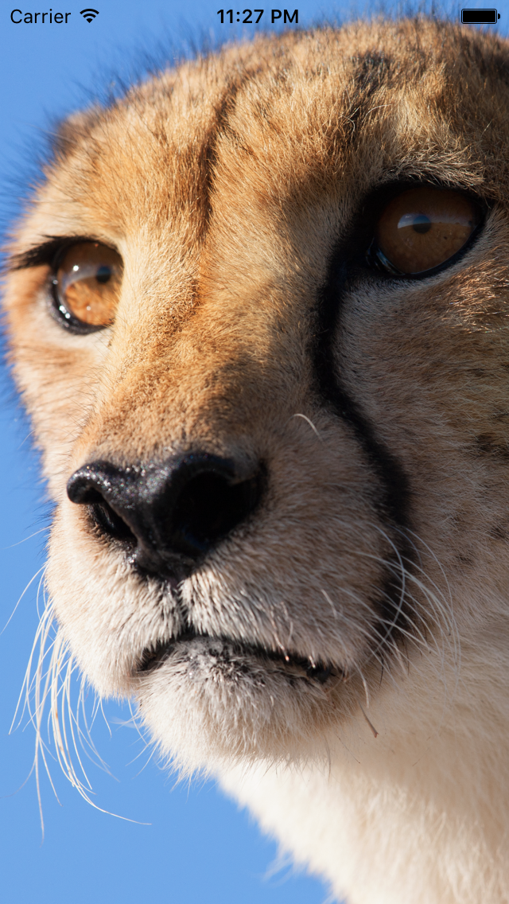
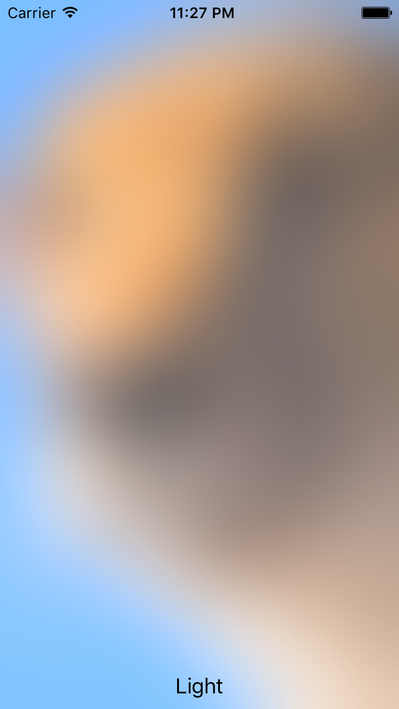
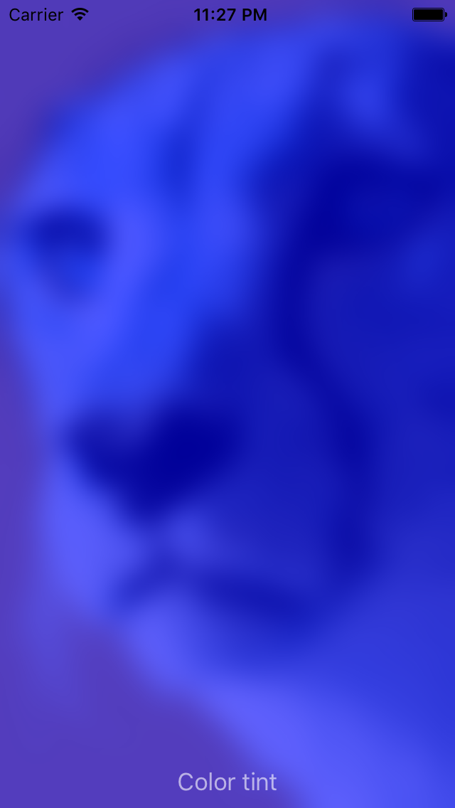
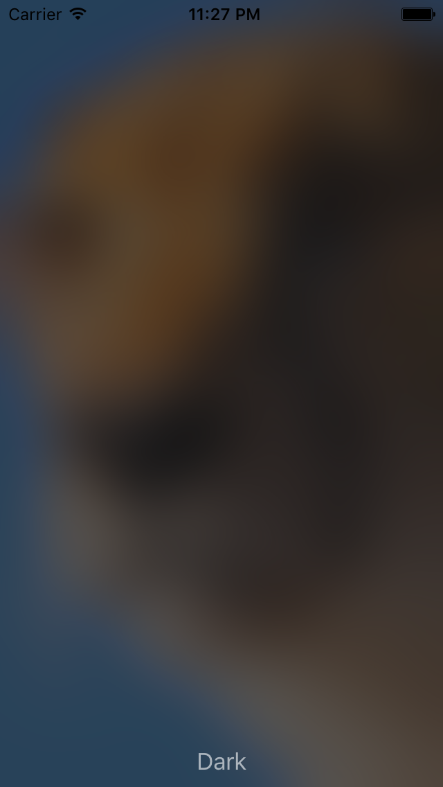
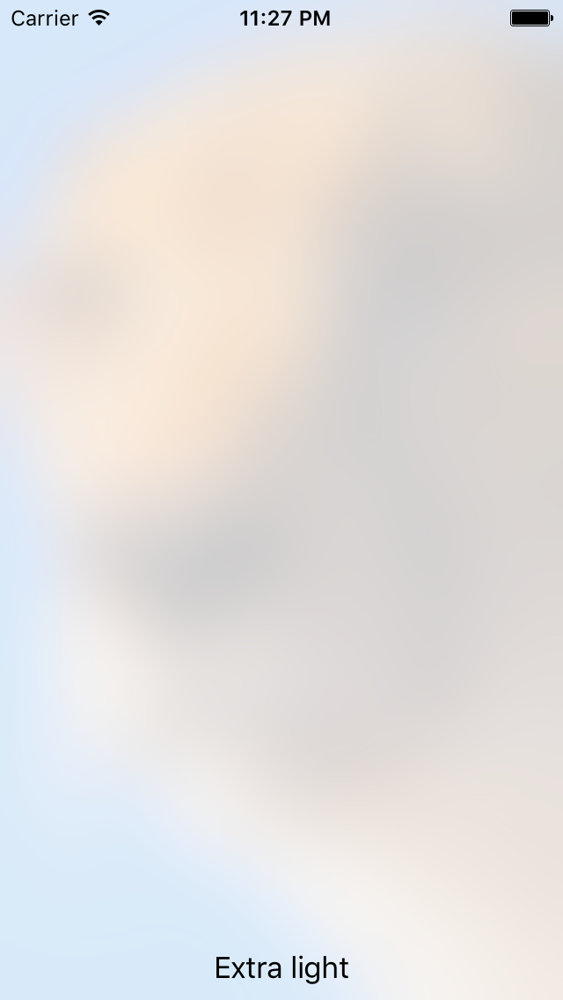

> 苹果官方提供的制作 blur image 的 demo，支持 tint color ；使用 vImage ，Quartz 框架里的 API 实现；vImage 是一个高性能的图片处理框架，以下是效果：

原图：

apply tint Color：[UIColor colorWithWhite:1.0 alpha:0.3]

apply tint Color：[UIColor blueColor] 

apply tint Color：[UIColor colorWithWhite:0.11 alpha:0.73]

apply tint Color：[UIColor colorWithWhite:0.97 alpha:0.82]

最低支持 iOS 7 ！